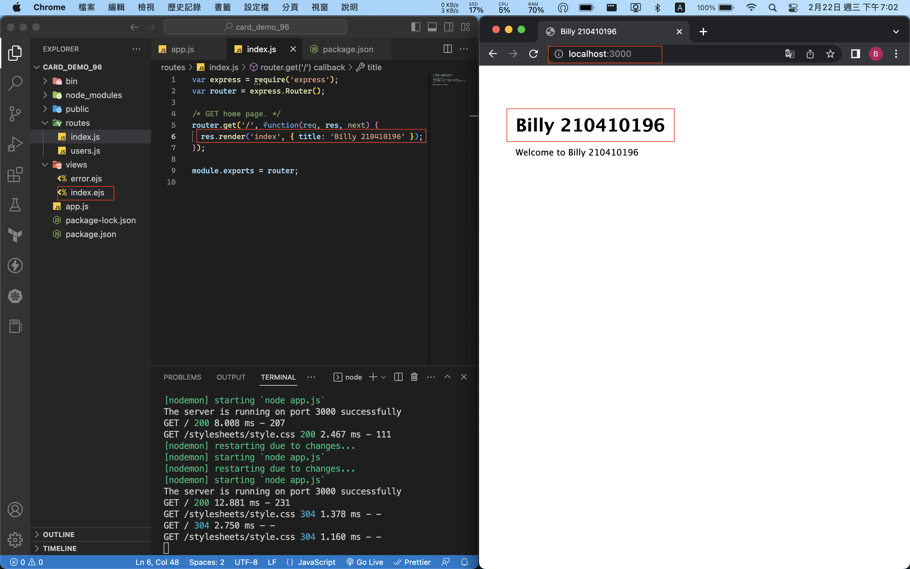
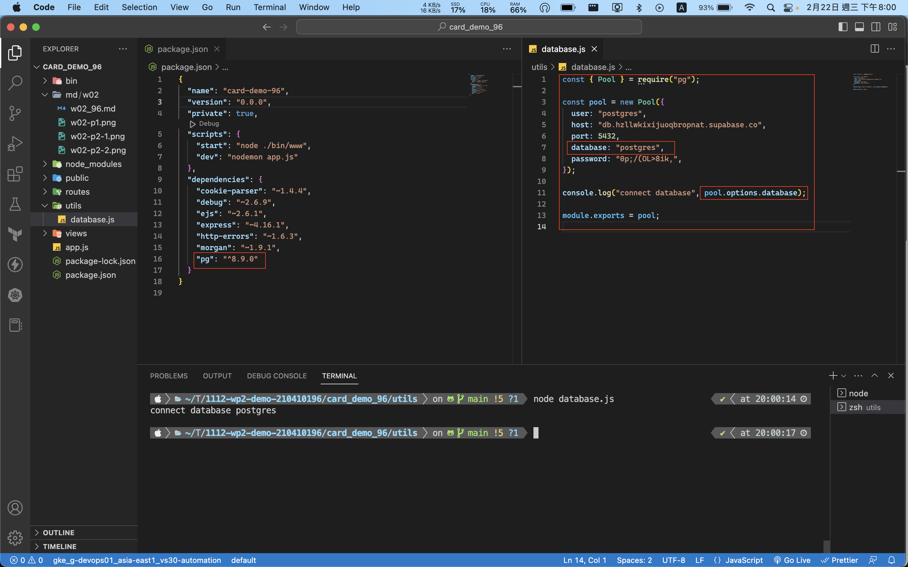
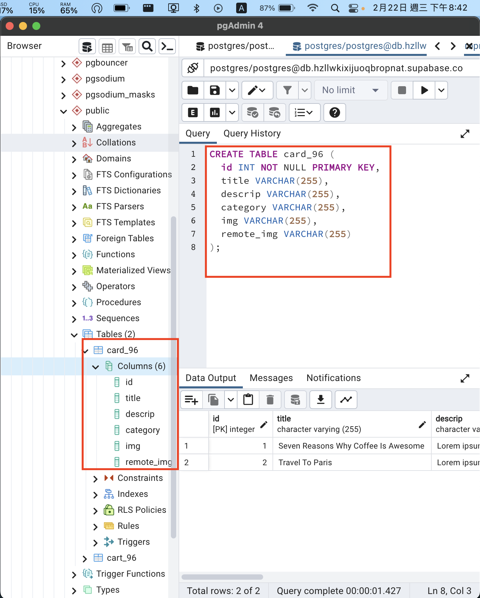
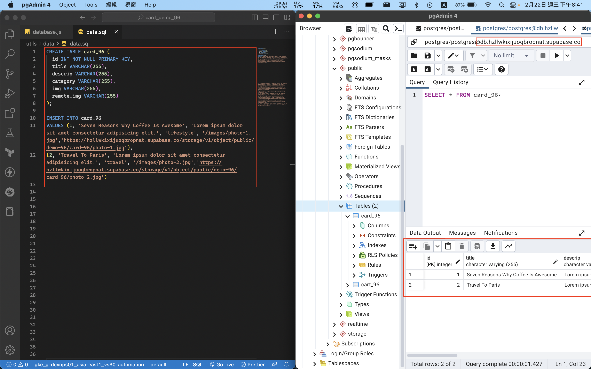
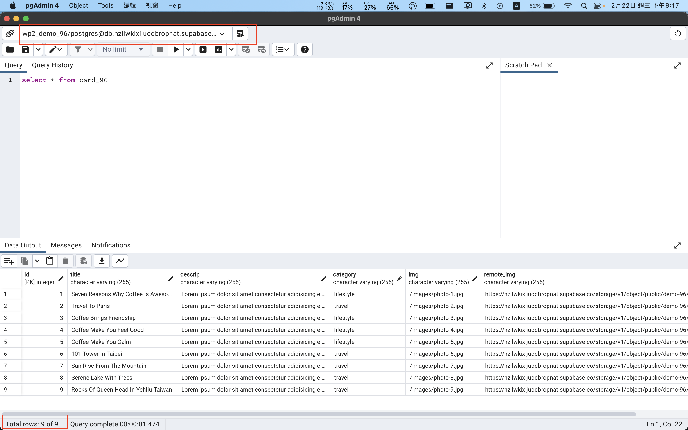
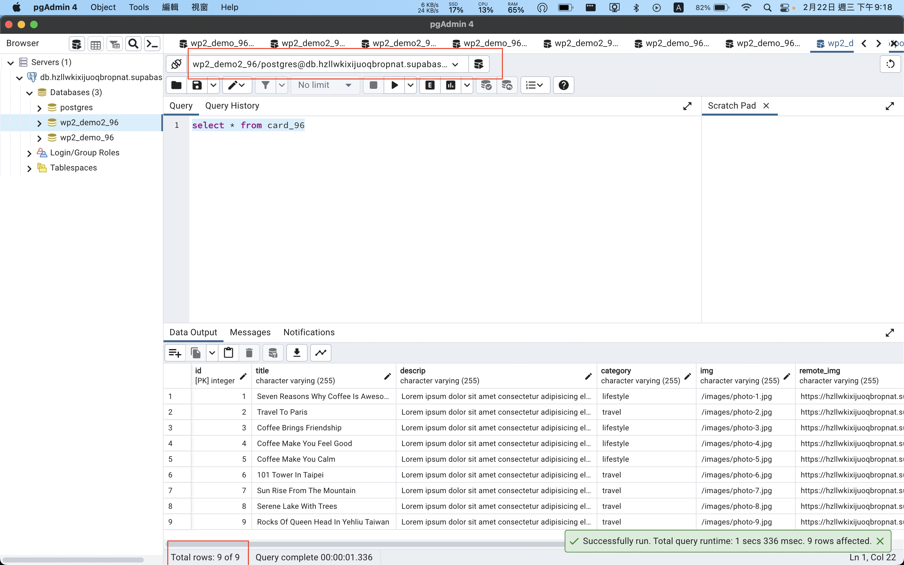

### W02-P1: Use express generator to create a server side framework, and display your info 

### `W02-P2: show static page of card demo with your info `
 

### W02-P3: database connection to wp2_demo_xx 

### W02-P4: create table card_xx with 2 data 
 

### W02-P5: card_xx 建立9筆資料，截圖，匯出到 wp2_demo_xx.tar，然後匯入到 wp2_demo2 資料庫中，要能顯示9筆資料
 
